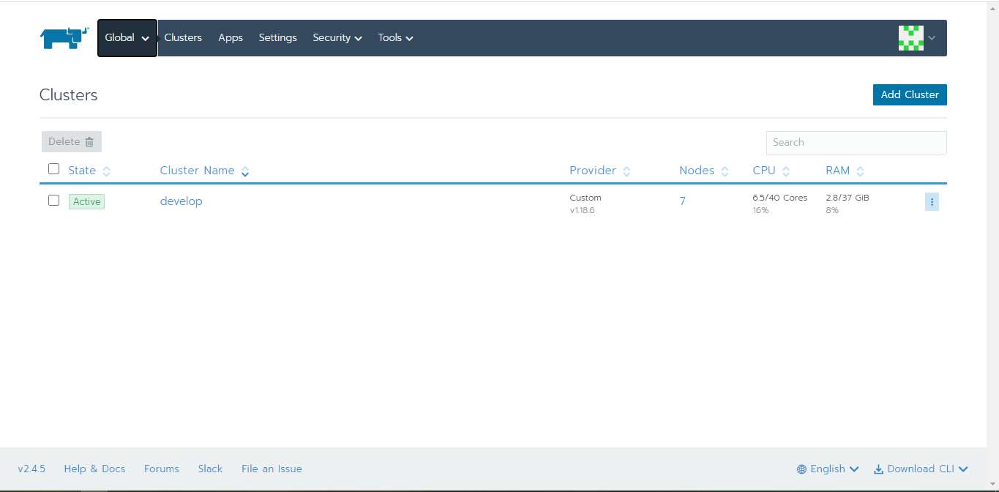
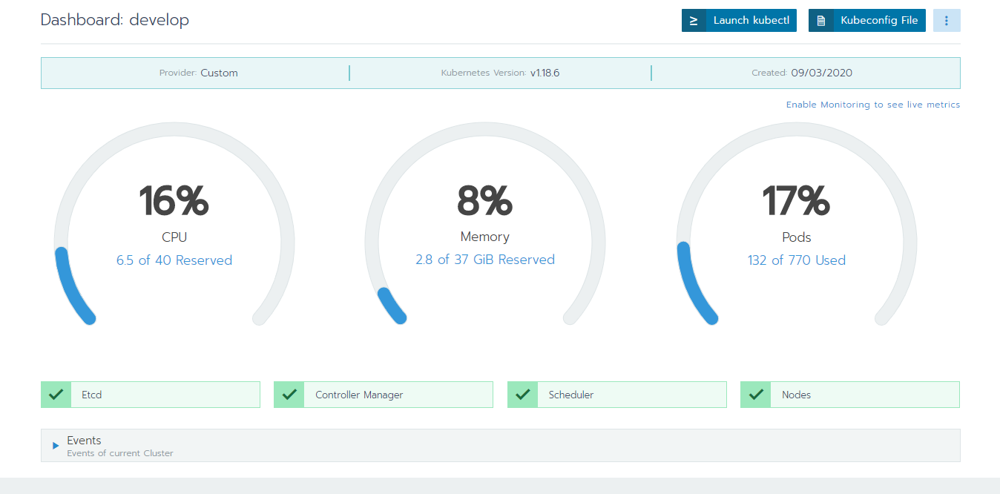
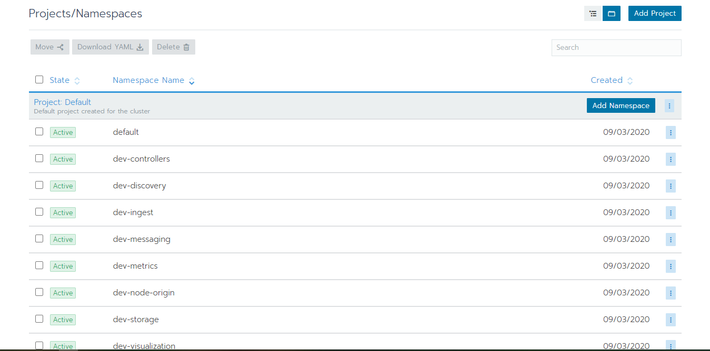
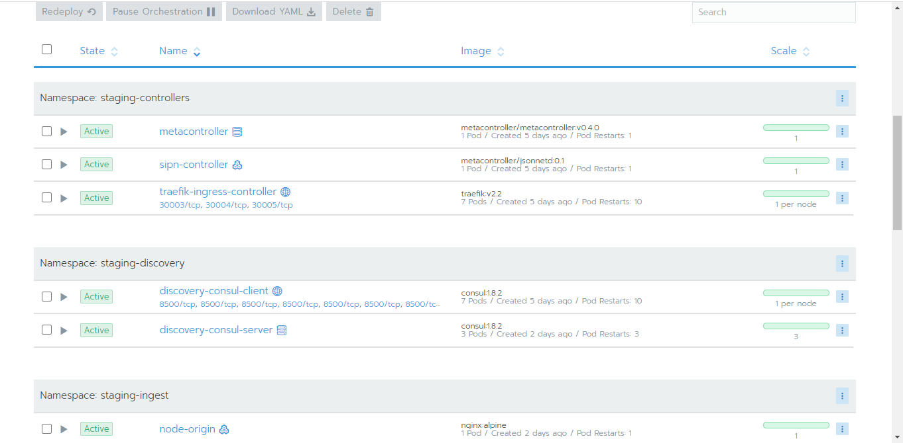

### Node Selector

* Label conversion
  * Prefix: ***.sigmaott.com**
  * Name: 
    * **Node-role**: Boolean
    * **data-dir**: String
      * Value: replace "." by "/" for real path name 
  * Example: 
    * Livestream.sigmaott.com/ingest-role: true

| stt |  component | label |
|:-:|---|---|
| 1  | Ingest Server  | node-role.sigmaott.com/ingest |
| 2 | Transcoder Server | node-role.sigmaott.com/transcode |
| 3 | Packager Server | node-role.sigmaott.com/packager |
| 4 | Origin Master | node-role.sigmaott.com/origin-master |
| 5 | Kubernetes + Api Server | node-role.sigmaott.com/api |
| 6 | Monitoring Server | node-role.sigmaott.com/monitor<br /> sigmaott.com/data-dir |
| 7 | Central logging system | node-role.sigmaott.com/logging<br />sigmaott.com/data-dir |
| 8 | Origin Node | node-role.sigmaott.com/origin-node<br />sigmaott.com/data-dir<br /> |


### Resource name convention
[Warning] when copy deployment from dev to (other env like prod), should change imagePullPolicy -> Always

* use alias as k8s resource (e.g: deployment -> deploy.yaml, service -> svc.yaml, statefulset -> sts, ...)

* group: controllers cannot have multi env (e.g: At the same time, there cannot be both dev and prod env existed)


### Installation
* Step 1: Clone this repo
* Step 2: Install tools
```bash
./scripts/install-tools.sh
```
* Step 3: Allow tools to communicate with the cluster
  * In rancher ui, click to your cluster name
  
  * Click 'Kubeconfig file'
  
  * A modal is show up, copy all the content and paste to .kube/config

* Step 4: Install workloads namespaces
```bash
./scripts/install-workloads-namespaces.sh <dev|staging>
```

* Step 5: Install Rancher app
  Follow the docs to install app with the config (values in helm terminology) in src/rancher-apps folder

* Step 6: Install workloads
```bash
./scripts/install-workloads.sh <dev|staging>
```

* Step 7: Add project
  * In rancher ui, click to your cluster name
  
  * Click Projects/Namespaces
  
  * Click Add project and type your project name
  * Select all your workload that is not in any project
  * Click Move and select option (your <project_name>)
]

* Step 8: View your result
  * In rancher ui, hover global tab (near the bull icon)
  
  * Hover your cluster name
  * Click on your project name
  * View result
  
