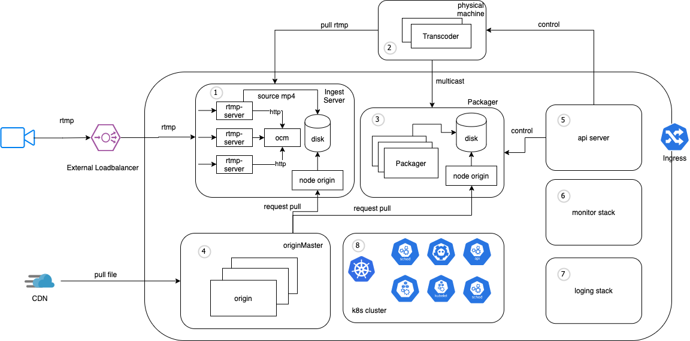

## System Architecture

#### 1. Ingest Server

Hệ thống cluster Ingest rtmp server xử lý dữ liệu đầu vào rtmp từ streamer, broadcaster

#### 2. Transcoder Machine

Hệ thống máy xử lý encode video phục vụ livestream adaptive bitrate

* Yêu cầu:
  * Máy chủ vật lý CPU hoặc GPU
  * Scale theo chiều ngang tuỳ thuộc số lượng kênh, profile cần xử lý
  * Card mạng đầu ra hỗ trợ multicast Layer 2. IGMP v2, v

#### 3. Packager + Origin

Hệ thống máy ảo hỗ trợ đóng gói luồng livestream theo các chuẩn đầu ra có thể chơi được ở máy
khách (HLS, DASH ... )

* Yêu cầu
  * Scale theo chiều ngang tuỳ thuộc số lượng kênh cần đóng gói
  * Card mạng đầu ra hỗ trợ multicast Layer 2. IGMP v2, v3 nhận luồng từ Transcoder
  * Hệ thống storage đảm bảo luồng tốc độ luồng ghi xuống ứng với số lượng kênh

#### 4. Origin master

Origin master đóng vai trò làm cầu nối giữa CDN và các node origin bên trong, giúp việc lấy dữ liệu thuận tiện hơn

#### 5. Kubernetes + Api Server

**K8s**: một công cụ cho phép quản lý và tổ chức (orchestration) service theo mô hình microservice. Hỗ
trợ các chức năng như: 

* Cân bằng tải và điều phối tài nguyên
* Tự phục hồi khi có lỗi xảy ra
* Tự động rollouts và rollbacks
* Đảm bảo HA cho toàn bộ hệ thống
* Để đảm bảo hệ thống chạy HA và có khả năng phục hồi tốt

**Api Server**: Quản lý, xử lý và điều phối toàn bộ các tác vụ của hệ thống. Các tính năng bao gồm:

* Api xử lý kênh livestream (CRUD)
* Hệ thống CMS

#### 6. Monitoring

Là một công cụ cho phép theo dõi và quản lý các thông số của hệ thống, cảnh báo khi hệ thống
gặp vấn đề

#### 7. Central logging system (ELK)

Là một công cụ cho phép thu thập, lưu trữ và quản lý tập trung log của các dịch vụ được triển khai
trong hệ thống.